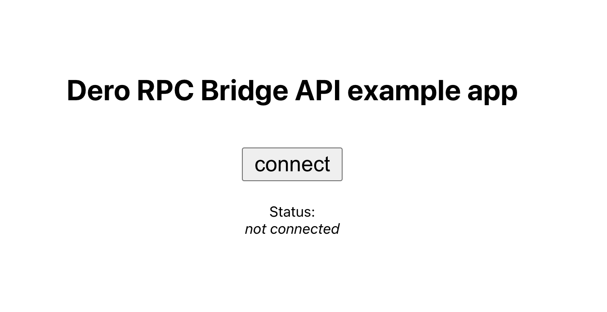
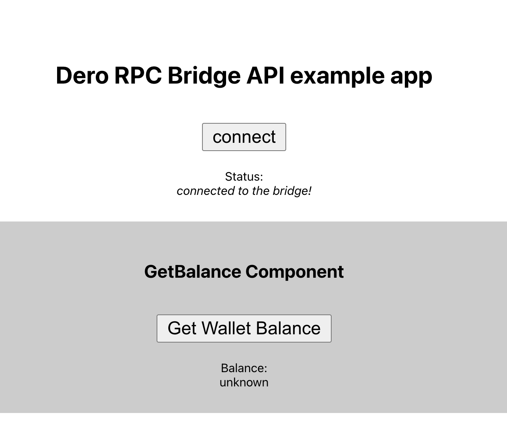
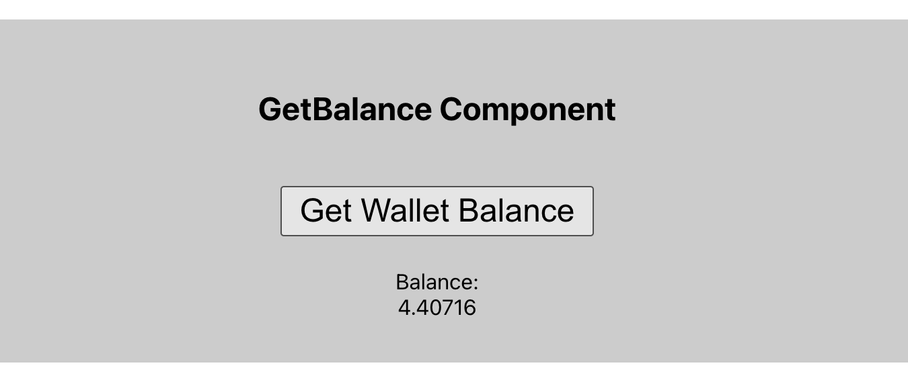

# DERO RPC BRIDGE API Tutorial

For this example we will be using the React Framework with [vite](https://vitejs.dev) and [yarn](https://yarnpkg.com/) tools.

Lets get right into it:

## Quick app setup


```sh
# create project using vite
yarn create vite
```

Then enter the *project name*, select `react` and `react-ts`.

When the project is created, you need to move to this folder, add the bridge to your project and install packages :

```sh
# Move into the project folder
cd PROJECT_NAME # change that to your actual project name

# Add the bridge to your project
yarn add dero-rpc-bridge-api

# Install dependencies and start dev server
yarn && yarn dev
```

Now you should have a running development server!

## Initialising the connection with the Bridge

Let's start with the main component (App.ts):

```ts
import './App.css'

// Simply return a div
function App() {

  return (
    <div className='App'>
    </div>
  )
}
```

We will declare a *state variable* `bridge` that will hold the object imported from the `dero-rpc-bridge-api`.

```ts
import { useState } from 'react' // Import useState
import './App.css'

import DeroBridgeApi from 'dero-rpc-bridge-api' // Import the brigde

function App() {
  // Add the state variable using useState hook
  const [bridge, setBridge] = useState<DeroBridgeApi>()

  return (
    <div className='App'>
    </div>
  )
}
```

Then add a button to connect to the bridge !

```ts
import { useCallback, useState } from 'react' // Import useCallback
import './App.css'

import DeroBridgeApi from 'dero-rpc-bridge-api'


function App() {

  const [bridge, setBridge] = useState<DeroBridgeApi>()

  // Add the button callback function
  const connect = useCallback(async () => {
    ...
  }, [])

  return (
    <div className='App'>
      // Add the button calling the connect function on click
      <button onClick={connect}>connect</button>
    </div>
  )
}
```


We will also setup a state variable, to handle the status of the connection to the bridge. We will start by declaring an enumeration of the different states:

In `utils/connection-status.ts` :
```ts
// Declare the enumeration. We will move this in a separate file later to 
export enum ConnectionStatus {
  NotConnected = "not connected",
  Connected = "connected to the bridge!",
  Connecting = "connecting...",
  Failed = 'connection failed !'
}

```

And declare the variable in `App.tsx`:

```ts
import { useCallback, useState } from 'react' 
import './App.css'

import DeroBridgeApi from 'dero-rpc-bridge-api'
import { ConnectionStatus } from './utils/connection-status' // Import ConnectionStatus enumeration


function App() {

  const [bridge, setBridge] = useState<DeroBridgeApi>()
  // Add status initialized with NotConnected
  const [status, setStatus] = useState<ConnectionStatus>(ConnectionStatus.NotConnected) 

  const connect = useCallback(async () => {
    ...
  }, [])

  return (
    <div className='App'>
      <button onClick={connect}>connect</button>
    </div>
  )
}
```

We're almost done with the first part ! We need to handle the click of the button :

```ts
  ...

  const connect = useCallback(async () => {

    // Start by setting the status of the connection to connecting when we click.
    setStatus(ConnectionStatus.Connecting);

    // Load the bridge in a local constant variable
    const deroBridgeApi = new DeroBridgeApi();

    // Initialise the object and handle the different Promise cases
    deroBridgeApi.init()
      .then(() => { // When connection is successful
        // We set status to Connected !
        setStatus(ConnectionStatus.Connected);
      })
      .catch((err: any) => { // If an error occured
        // We just put the error message as the status. We could handle it better, but it works for this example !
        setStatus(err.message);
      })

    // Then we save the object in the app's state variable.
    setBridge(deroBridgeApi);
    
  }, [])

  ...
```


Great ! Now we should end up with this :

#### App.tsx
```ts
import { useCallback, useState } from 'react'
import logo from './logo.svg'
import './App.css'

// @ts-ignore
import DeroBridgeApi from 'dero-rpc-bridge-api'
import { ConnectionStatus } from './utils/connection-status'


function App() {
  const [bridge, setBridge] = useState<DeroBridgeApi>()
  const [status, setStatus] = useState<ConnectionStatus>()

  const connect = useCallback(async () => {
    setStatus(ConnectionStatus.Connecting);

    const deroBridgeApi = new DeroBridgeApi();

    deroBridgeApi.init()
      .then(() => {
        setStatus(ConnectionStatus.Connected);
      })
      .catch((err: any) => {
        setStatus(err.message);
      })

    setBridge(deroBridgeApi);
  }, [])

  return (
    <div className='App'>
      <button onClick={connect}>connect</button>
      <div>Status: {status}</div>
    </div>
  )
}

export default App
```

#### connection-status.ts
```ts
export enum ConnectionStatus {
    NotConnected = "not connected",
    Connected = "connected to the bridge!",
    Connecting = "connecting...",
    Failed = 'connection failed !'
}  

```

Then when you open [](http://localhost:3000) :


And click on connect :


## Create a context to access the bridge anywhere in the app.

Now we'll setup a context with the useContext hook in `App.tsx`:
```ts
import { useCallback, useState } from 'react'
import './App.css'

// @ts-ignore
import DeroBridgeApi from 'dero-rpc-bridge-api'
import React from 'react';
import GetBalanceComponent from './components/GetBalanceComponent';
import { ConnectionStatus } from './utils/connection-status';


// Global context variable to use all across the app
export const DeroContext = React.createContext<DeroBridgeApi>(null);


// App component
function App() {

  const [bridge, setBridge] = useState<DeroBridgeApi>()
  const [status, setStatus] = useState<ConnectionStatus>(ConnectionStatus.NotConnected)

  // Callback when we click the connect button
  const connect = useCallback(async () => {
    setStatus(ConnectionStatus.Connecting);
    const deroBridgeApi = new DeroBridgeApi();
    deroBridgeApi.init()
      .then(() => {
        setStatus(ConnectionStatus.Connected);
      })
      .catch((err: any) => {
        setStatus(err.message);
      })
    setBridge(deroBridgeApi);
  }, [])

  return (
    // Pass the bridge object to the context provider
    // The app has a title a button calling the connect callback defined earlier and a custom components defined in components/
    <DeroContext.Provider value={bridge}>
      
      // App wrapper
      <div className='App'>
        <h1>Dero RPC Bridge API example app</h1>
        
        <button onClick={connect}>connect</button>
        
        <div>Status:</div>
        <div><i>{status}</i></div>
        
        // A GetBalanceComponent that we are going to create soon !
        <GetBalanceComponent status={status}/>
        

      </div>
    </DeroContext.Provider>
  )
}

export default App

```

Then create a component that gets the balance in `components/GetBalanceComponent.ts`:
```ts

import { useCallback, useContext, useState } from "react"
import { DeroContext } from "../App";
import { ConnectionStatus } from "../utils/connection-status";

// Define the props of our component
interface Props {
    status: ConnectionStatus
}

// GetBalanceComponent definition
export default (props: Props) => {
    // Balance and error message, updated when clicking the Get Balance button
    const [balance, setBalance] = useState<string | number>('unknown');
    const [errorMessage, setErrorMessage] = useState<string>();

    // Here we get the bridge object from the context
    const deroBridgeApi = useContext(DeroContext);
    
    // Callback when clicking the Get Balance button
    const getBalance = useCallback(async () => {
        // Call the GetBalance method from the wallet
        deroBridgeApi.wallet('get-balance')
            .then((response: any) => { // When successful
                // Update the balance state of the component
                setBalance(response.data.result.balance / 100000)
                // Empty the error message
                setErrorMessage("");
            })
            .catch((err: any) => { // When failed
                // Update the balance to unknown
                setBalance('unknown');
                // Update the error message
                setErrorMessage(err.message);
            })
    }, [props.status]) // Update the function when the connection status change so that the context actually provide a deroBridgeApi object

    // We render the component only if status is connected 
    if (props.status == ConnectionStatus.Connected) {
        return <div className='GetBalanceComponent'>
            // Title
            <h2>GetBalance Component</h2>

            // Button
            <button onClick={getBalance}>Get Wallet Balance</button>

            // Balance display
            <div>Balance:</div>
            <div>{balance}</div>
            <div>{errorMessage}</div>
        </div>
    } else {
        return <div></div>
    }
    
}

```
 And it gives us :



Clicking on the `Connect` button :

Clicking on the `Get Balance`button :


## Done !
We've got a fonctional connection to the bridge, usable in all the application with a Context !
